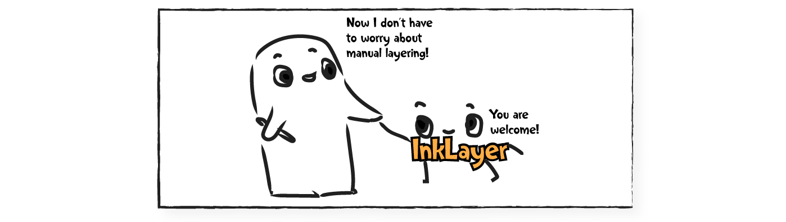

# Instance Segmentation of Scene Sketches Using Natural Image Priors (SIGGRAPH 2025)
<a href="https://mia-tang.com/" target="_blank">Mia Tang</a>, 
<a href="https://yael-vinker.github.io/website/" target="_blank">Yael Vinker</a>, 
<a href="https://nauhcnay.github.io/" target="_blank">Chuan Yan</a>, 
<a href="https://lllyasviel.github.io/Style2PaintsResearch/lvmin" target="_blank">Lvmin Zhang</a>, 
<a href="https://graphics.stanford.edu/~maneesh/" target="_blank">Maneesh Agrawala</a>


<a href="https://inklayer.github.io/"></a>
<a href="https://arxiv.org/abs/2502.09608"></a>

*We introduce InkLayer, a method for instance segmentation of raster scene sketches. It effectively handles diverse types of sketches, accommodating variations in stroke style and complexity.*



## 🔖 Release Status

- &#x1F5F9; Benchmark dataset and dataset viewer: <a href="https://www.inkscenes-dataset.com/" target="_blank">🔗 Visit Our Viewer!</a>
- &#x1F5F9; Segmentation inference code and weights
- &#9744; Sketch layering code & sketch editing interface

## 🛠️ Installation

Please clone this repository with submodules!
```bash
# Clone the repository with submodules
git clone --recurse-submodules git@github.com:miatang13/InkLayer.git
cd InkLayer
```

### Set up conda environment
```bash
conda create -n inklayer python=3.10
conda activate inklayer
conda install pytorch torchvision torchaudio pytorch-cuda=12.4 -c pytorch -c nvidia
```

<details>
<summary><strong>Check your CUDA installation</strong></summary>
Make sure you have CUDA set up correctly!

```bash
python -c "import torch; print(torch.__version__)"
python -c "import torch; print(torch.version.cuda)"
```

Run the sanity checks above. If you see the correct versions (something like `2.5.1` and `12.4`), you are good to go! 👏
</details>


### Set up a few dependencies 
You should see `GroundingDINO`, `segment-anything`, and `Depth_Anything_V2` in `InkLayer/third_party/` folder. If you do not, it means you did not clone the repository with submodules 😔. Run the following command to clone the submodules:
```bash
git submodule update --init --recursive
``` 

Okay, now let's set up the dependencies! 
```bash
(cd ./InkLayer/third-party/GroundingDINO && pip install -e . )
(cd ./InkLayer/third-party/segment-anything && pip install -e . )
```

Download weights! (You can execute this command wherever, the weights will be downloaded into `models` correctly ◝(ᵔᗜᵔ)◜)
```bash
bash models/download_ckpts.sh
```

### Set up InkLayer
Now you can install InkLayer. At the root directory, run
```bash 
pip install -e .
```
Now you should be able to import InkLayer anywhere in your Python scripts! 🎉

<details>
<summary><strong>A note on the weights</strong></summary>

In our download script, we include `models/inklayer_gdino.pth`, which is our fine-tuned version of GroundingDINO for sketch detection, following the official GroundingDINO architecture and format. While we originally fine-tuned GroundingDINO using the [mmdetection]() framework, we converted the resulting weights to the original GroundingDINO format to simplify integration, as setting up mmdetection can be a bit more involved. If you prefer to use the mmdetection version directly, you can find it on [huggingface](https://huggingface.co/miatang13/InkLayer/tree/main) at `inklayer_gdino_mmdetection.pth`. The conversion was done using the script provided in this GitHub issue: [mmdetection issue](https://github.com/open-mmlab/mmdetection/issues/11200).

We observe very similar performance between the two versions of the weights, with slightly worse box IoU for the official GroundingDINO format, but higher AR and AP. We recommend using this version if your task is not highly sensitive to box precision. To replicate exact evaluation results reported in the paper, please use the mmdetection version of the weights. Feel free to reach out to miatang@stanford dot edu if you need help with the mmdetection version.

</details>

## 🏃‍♀️ Running Inference
You can run inference on a single image using the following command:
```bash
python main.py --img {PATH_TO_YOUR_IMAGE}
```
A sample command using our test sketch is
```bash
python main.py --img data/bunny_cook_sketch.png 
``` 
To run inference on an entire directory of images:
```bash
python main.py --dir {PATH_TO_IMAGE_DIRECTORY}
```
By default, all outputs will be saved to `./output/{IMAGE_NAME}/`. You can specify a different output directory using the `--out_dir` argument:

If you would like to skip saving intermediate outputs (e.g., intermediate masks, visualizations), you can add the `--no_intermediate` flag:

```bash
python main.py --img data/bunny_cook_sketch.png --no_intermediate
```

The final segmented sketch is visualized at `./{OUT_DIR}/{IMAGE_NAME}/segmented_sketch_final.png` and the masks are at `./{OUT_DIR}/{IMAGE_NAME}/masks_final/mask_{ID}.png`. 

## 📎 Notes
For reference, here are the  commit hash for the submodules that we used in our experiments:
```bash
GroundingDINO: 856dde20aee659246248e20734ef9ba5214f5e44
segment-anything: 3f6d89896768f04ded863803775069855c5360b6
```