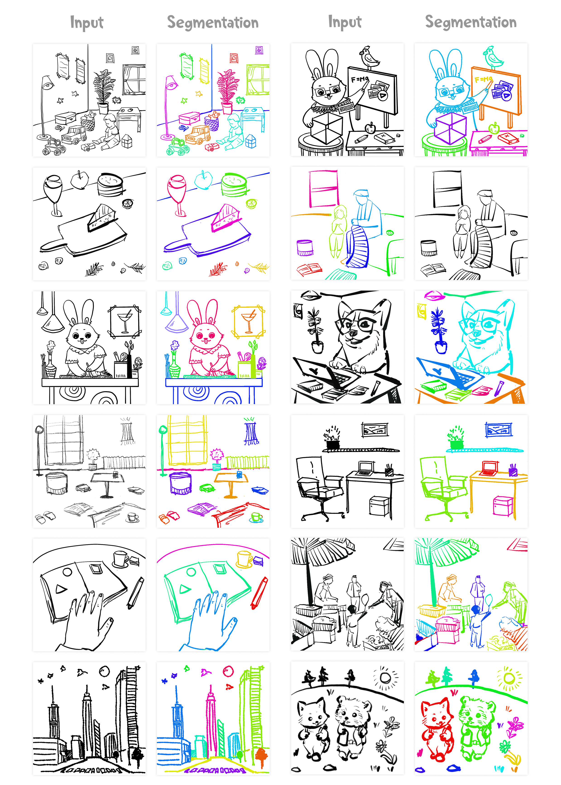

# Instance Segmentation of Scene Sketches Using Natural Image Priors

We introduce SketchSeg, a method for instance segmentation of raster scene sketches. It effectively handles diverse types of sketches, accommodating variations in stroke style and complexity.

<a href="https://sketchseg.github.io/sketch-seg/"></a>


> Sketch segmentation involves grouping pixels within a sketch that belong to the same object or instance. It serves as a valuable tool for sketch editing tasks, such as moving, scaling, or removing specific components. While image segmentation models have demonstrated remarkable capabilities in recent years, sketches present unique challenges for these models due to their sparse nature and wide variation in styles. We introduce SketchSeg, a method for instance segmentation of raster scene sketches. Our approach adapts state-of-the-art image segmentation and object detection models to the sketch domain by employing class-agnostic fine-tuning and refining segmentation masks using depth cues. Furthermore, our method organizes sketches into sorted layers, where occluded instances are inpainted, enabling advanced sketch editing applications.


## Description

Official implementation of our _Instance Segmentation of Scene Sketches Using Natural Image Priors_ paper.

## Code Coming Soon! 🚧

- &#9744; Segmentation inference code and weights
- &#9744; Sketch layering code & Sketch editing interface
- &#9744; Benchmark dataset and dataset viewer

## Gallery



## Citation

If you use this code for your research, please cite the following work:

```
arXiv citation coming soon!
```
